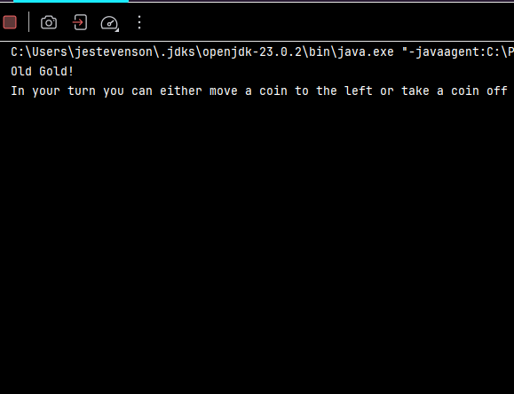

# Results of Testing

The test results show the actual outcome of the testing, following the [Test Plan](test-plan.md)

---

### Bored set up 

Testing that the bored is set up correctly by checking there are the correct amount of spaces and the correct amount of coins as stated by the constants at the top of the code.

### Test Data Used
Run the code. 

### Test Result

The bored isn't showing up at all because it just doesn't feel like it.

---

### User input

Testing that the user can select a coin and move it.

### Test Data Used

Running the program and playing it multiple times.
### Test Result

Comment on test result. Comment on test result. Comment on test result. Comment on test result. Comment on test result. Comment on test result.

---
### Win Condition 

Testing that when the gold coin is taken off the bored the game ends and the player who took it off the bored is declared as the winner.

### Test Data Used 

Running the program multiple times.

### Test Result

Comment on test result. Comment on test result. Comment on test result. Comment on test result. Comment on test result. Comment on test result.
---

### Boundaries

Testing that a coin can spawn on the right-most space and that coins can be placed into the left-most space on the bored.

### Test Data Used 

Running the code multiple times.

### Test Result 

Comment on test result. Comment on test result. Comment on test result. Comment on test result. Comment on test result. Comment on test result.
---

### Invalid Inputs 
Example test description. Example test description. Example test description. Example test description. Example test description. Example test description.

### Test Data Used 

Playing the game and trying to input an invalid move.

### Test Result

Comment on test result. Comment on test result. Comment on test result. Comment on test result. Comment on test result. Comment on test result.
---

